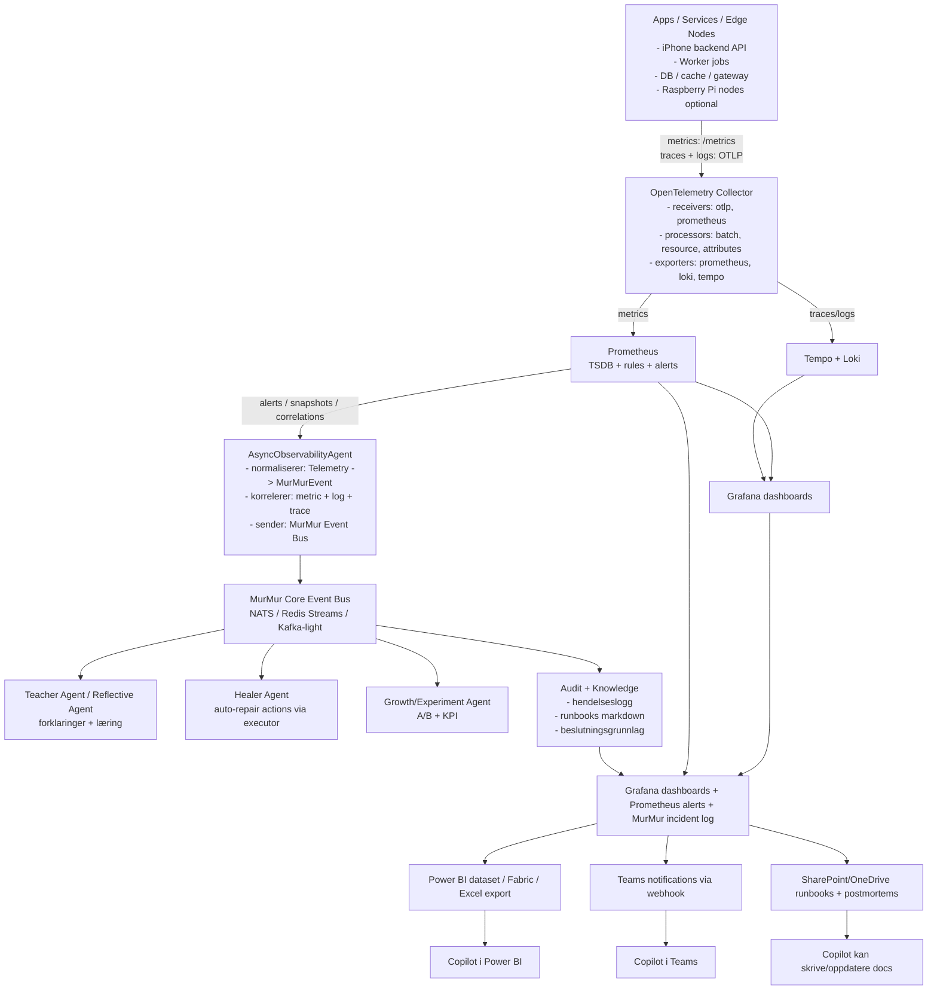

# MurMur Observability & Agent Orchestration Architecture

This document captures the proposed end-to-end telemetry and autonomous response flow for MurMur.

## High-level flow

## Responsibilities by layer

- **Instrumentation producers** emit metrics and OTLP traces/logs from app and edge runtimes.
- **OpenTelemetry Collector** centralizes ingestion, processing, enrichment, and fan-out.
- **Prometheus + Grafana + Tempo + Loki** provide primary observability UX and durable telemetry backends.
- **AsyncObservabilityAgent** converts raw telemetry into domain events (`MurMurEvent`) with cross-signal correlation.
- **MurMur Core Event Bus** distributes correlated events to autonomous agents for explanation, healing, and growth.
- **Audit + Knowledge** persist decisions and context as a replayable operational memory.

## Copilot-friendly dissemination layer

To support the additional collaboration flow, MurMur should produce a consolidated incident context stream from:

- Grafana dashboards
- Prometheus alerts
- MurMur incident log

From this shared stream, publish to Microsoft 365 touchpoints:

- **Power BI / Fabric / Excel export** for analytical copilots and executive reporting.
- **Teams webhooks** for real-time notifications and conversational triage in Copilot for Teams.
- **SharePoint / OneDrive** for runbooks and postmortems so Copilot can draft and update operational docs.

## Recommended data contracts

1. Define a `MurMurEvent` schema with:
   - source service / node
   - event category (`metric_alert`, `trace_anomaly`, `log_pattern`, `correlated_incident`)
   - severity and confidence
   - correlation keys (trace id, span id, service, environment, deploy version)
   - suggested actions + provenance
2. Require every autonomous agent output to include:
   - reasoned explanation
   - executed / proposed action
   - expected KPI impact
   - rollback instruction (if actioning)
3. Store all decisions with links to the originating telemetry to preserve auditability.

## Implementation notes

- Start with **NATS** for low-friction event bus setup; evolve to Redis Streams or Kafka if retention/replay needs grow.
- Keep correlation rules in versioned config and treat them as production code.
- Add runbook references directly to generated incidents to reduce mean time to recovery.
- Ensure all repair actions are idempotent and gated by policy.
- Add a small export adapter that maps `MurMurEvent` to Power BI/Teams/SharePoint payload shapes (with PII redaction).

