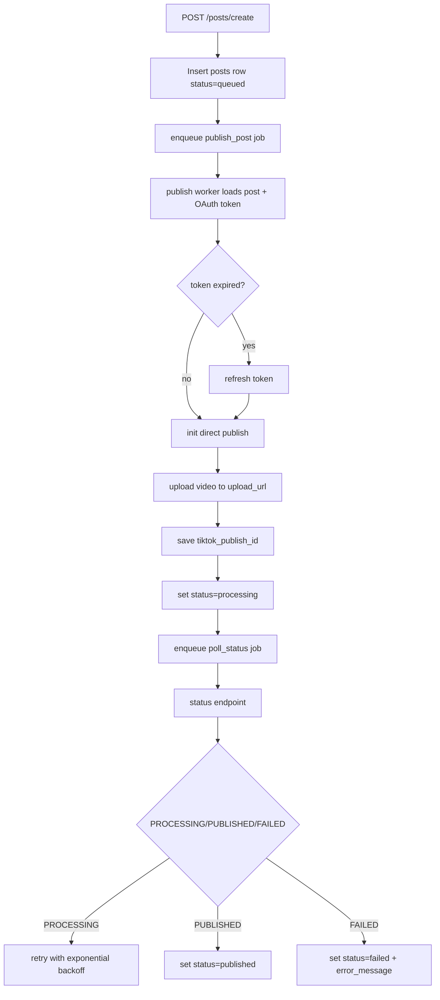

# MurMur Stronghold Services

## TikTok Direct Publish Flow

## Job Lifecycle

1. `publish_post`
   - attempts: 5
   - exponential backoff
   - transitions post status `queued -> uploading -> processing`
2. `poll_status`
   - attempts from `PUBLISH_STATUS_MAX_ATTEMPTS` (default 5)
   - retries every 30 seconds with exponential backoff while TikTok returns `PROCESSING`
   - final status transition to `published` or `failed`

## Error Handling

- No raw OAuth tokens are logged.
- All worker exceptions write minimal error messages to `posts.error_message`.
- Failed jobs leave posts in `failed` state for operator visibility.
